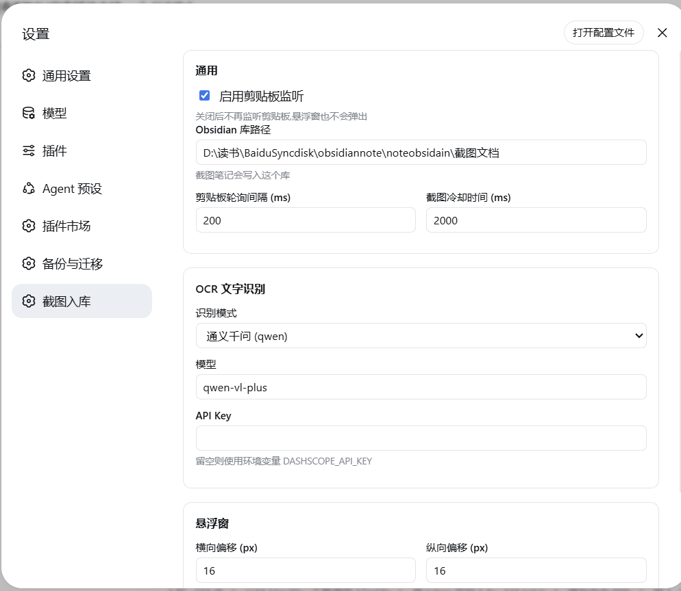
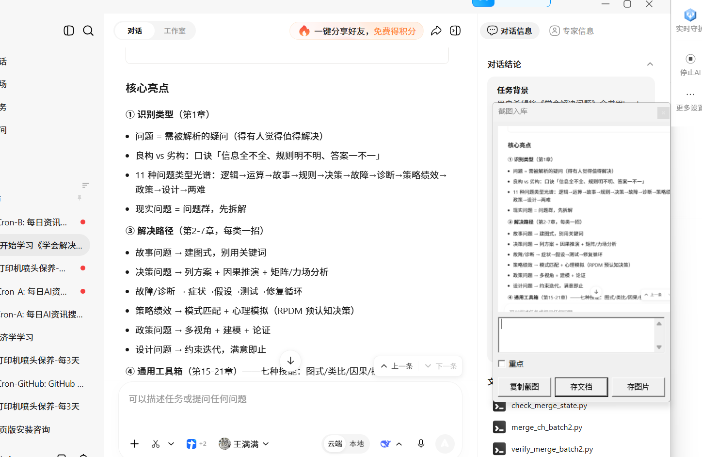
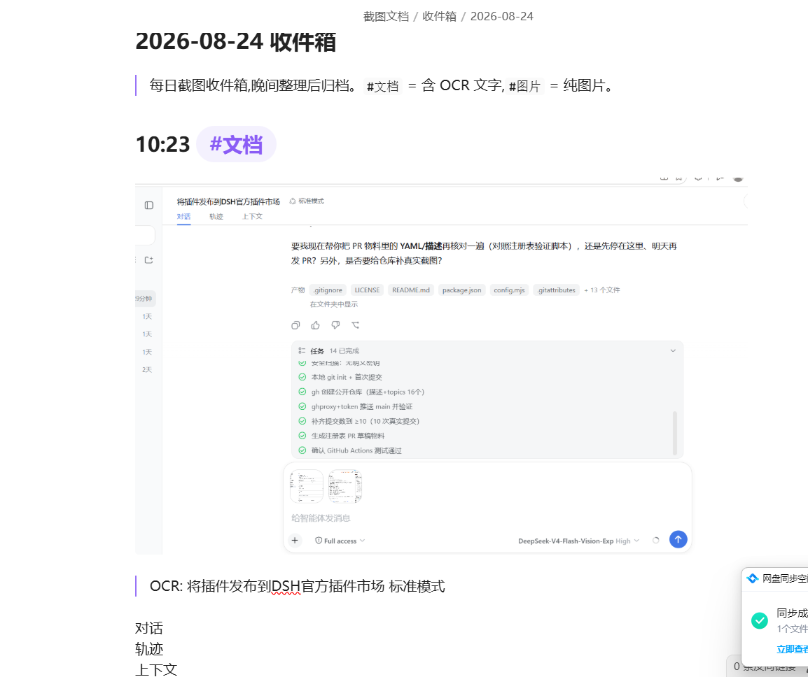

# dsh-screenshot-capture · 指哪拍哪 (Point-and-Shoot Capture)

DeepSeek Harness 插件:截屏即存 —— 监听剪贴板 → 鼠标位置弹出系统级悬浮窗
【注释输入框 +「重点」复选框 + 复制截图 / 存文档 / 存图片】→ 图片 + 即时 OCR(默认走**宿主自己的多模态大模型**,零配置)
写入 Obsidian 按天合并笔记 → 晚间 AI 整理(点选保留 / 保存全部 → 归类 → 双链 → 当日总结 → 归档)。

A [DeepSeek Harness](https://github.com/deepseek-ai/deepseek-harness)(DSH) plugin that turns a screenshot (or any copied image) into
an Obsidian note: a system-level floating window appears next to your mouse, lets you add a comment / mark it as a
key point, then saves the image with instant OCR into a per-day note, and an optional
evening AI pass organizes the day's entries with categories, backlinks, a summary, and archival.
OCR uses the **host's own multimodal model by default — no extra API key** — and falls back to the
[Tongyi Qianwen](https://dashscope.aliyuncs.com) API when a key is configured.
`v0.2.2` adds host-model OCR, the `ocr.hostModel` setting and the reliability fixes listed in the changelog.

[](https://awesome-dsh-plugin.com)

## 功能 / Features

- **Windows 系统级悬浮窗**:检测到新截图(或复制图片)后,在鼠标旁弹出置顶小窗,三键选择;
- **注释 / 重点标记(v0.2.0)**:弹窗内置注释输入框 +「重点」复选框;勾重点后该条注释以标题一 `**重点**` 写入笔记,提示这是重点;
- **存文档**:图片入库 + 当天笔记立即生成,OCR 文字 1~5 秒后自动回填;
- **存图片**:仅图片入库(`#图片` 标签);
- **即时 OCR**:默认用**宿主大模型**(DSH 已在用的多模态模型,零配置、不用另申请 key);宿主不可用时自动回落通义千问;两条都不可用会在笔记里写明原因,不影响入库;
- **助手自愈(v0.2.2)**:常驻的剪贴板助手指令意外退出时,按退避自动重启(2s→30s,最多 5 次)并告警,不再"截图静默失效";
- **同一屏去重(v0.2.2)**:Windows 截图工具偶尔会把**同一屏**往剪贴板连写两遍(实测两张只差 1 像素、相隔 3 秒),助手按 32×32 灰度指纹比对,`dupWindowMs`(默认 6 秒)内的近似同屏只弹一次窗、只存一条;
- **回填不丢字(v0.2.2)**:笔记被云同步盘 / Obsidian 短暂占用时,写入按 ~4.6 秒退避重试并改走"临时文件 + 原子替换";两次仍失败会把识别结果暂存到 `%TEMP%\dsh-capture\pending-ocr.jsonl` 并告警;
- **晚间 AI 整理**:对当天收件箱条目,点选保留/保存全部 → 归类 → 生成分类笔记 + 双链 → 当日总结 → 归档;
- **Web 图形配置界面**:DSH 设置 →「截图入库」,改动实时生效。

## 截图 / Screenshots

DSH 设置 →「截图入库」图形配置界面:



截图后鼠标旁弹出的系统级悬浮窗(注释 + 重点 + 复制截图 / 存文档 / 存图片):



入库后的 Obsidian 按天合并笔记(含 OCR 文字):



## 环境要求 / Requirements

- **Windows**(依赖系统自带 PowerShell 5.1 + WinForms)
- **DSH 0.1.7+**(Web 设置页依赖 `configForms` 服务;旧版 DSH 上 host 功能照用、设置页不出现)
- **宿主大模型 OCR**:需要 DSH 已加载 `llm` + `attachments` 服务,且当前模型在目录里声明了
  `inputModalities: [ text, image ]`(DSH 里看到"图片输入"能力的模型即可)。不满足会自动回落千问
- 通义千问 API key(**可选**,只在回落时用到;通过 `DASHSCOPE_API_KEY` 环境变量,或插件配置文件)
- Obsidian 库(或任意本地 markdown 目录)

## 安装 / Install (DSH plugin)

```sh
# 从 npm 安装(若已发布)
dsh plugin --profile desktop add dsh-screenshot-capture

# 从 GitHub 源安装
dsh plugin --profile desktop add github:wangzhanchao883/dsh-screenshot-capture

# 或用本地目录(开发时)
dsh plugin --profile desktop add ./dsh-screenshot-capture
```

重启 DSH 后生效。剪贴板监听与悬浮窗由插件 host 端自动拉起(需要 DSH 运行中)。

> 首次使用请先在 DSH 设置 →「截图入库」里配置你的 Obsidian 库路径。OCR 默认就能用(走宿主模型)。
> 未配置 `vaultPath` 时采集功能会自动停用并告警。

## 配置 / Configuration

### 方式一:Web 图形界面 / Web settings (推荐)

DSH Web 界面 → 侧栏 **设置** → **截图入库** 分区,直接改:
- 通用:启用监听、Obsidian 库路径、轮询间隔、冷却时间
- OCR:识别通道(`host` 宿主大模型(默认) / `off` 关闭)、宿主模型(留空 = 跟随 DSH 当前默认模型)
- 悬浮窗:横向/纵向偏移、预览最大宽度

> 面板里**不再有千问配置项**(v0.2.2 起):宿主模型是默认通道,千问只作为自动回落,key 从 `DASHSCOPE_API_KEY` 环境变量或 `config.json` 读取,不需要在界面上填。

改动**实时生效**(DSH 会热重载本插件,监听器随之重启)。配置写入 profile 的条目 config
(`cordis.patch.yml` 里 `insert[].config`),它就是权威值;`config.json` 只作为下面的 base 层。

> ⚠️ 面板里显式写过的字段会**优先于** `config.json`。如果你只是想临时试一下,记得改回库根,否则截图会一直存到你选的目录。

### 方式二:配置文件 / config file (base 层)

`%USERPROFILE%\.dsh-screenshot-capture\config.json`

```jsonc
{
  "enabled": true,
  "vaultPath": "D:\\path\\to\\obsidian-vault",
  "ocr": { "mode": "host", "hostModel": "", "model": "qwen-vl-plus", "apiKey": "" },
  "pollIntervalMs": 200,
  "cooldownMs": 2000,
  "dupWindowMs": 6000
}
```

- `ocr.mode` 三选一:`"host"`(默认,宿主多模态模型)、`"qwen"`(通义千问)、`"off"`(不识别;`qwen` 面板里不提供,配置里仍兼容);
- `ocr.hostModel` 留空 = 跟随 DSH 当前默认模型;填了就用指定模型(仍需该模型声明图片输入);
- 千问 key 也可放环境变量 `DASHSCOPE_API_KEY`(避免明文落盘),只在 `host` 失败回落时用到;
- `dupWindowMs` = 同屏去重窗口(毫秒,默认 6000,`0` 关闭);面板里不提供,需要时改这里。

> 注意:插件**默认不带库路径**(为空)。未配置 `vaultPath` 时,采集功能会自动停用并告警,不会创建任何目录。首次使用请务必在 Web 设置 / `config.json` 里配置你自己的 Obsidian 库路径。

## 使用 / Usage

1. 开着 DSH;
2. `Win+Shift+S` 框选截图(或 `Ctrl+C` 复制任意图片);
3. 悬浮窗出现在鼠标旁:先在注释框里写注释/评论(可选),需要的话勾选「重点」,再选【复制截图 / 存文档 / 存图片】;
4. 晚上对 DSH 说"整理今天的截图",按提示选择保留条目。

> 连拍两张也没问题:识别较慢时请求会排队,不会出现笔记里卡在「OCR: 识别中…」。

### 注释与「重点」标记 / Comments & key points

- 截图时填写的注释会写入当天收件箱该条目下方;
- 勾选「重点」后,注释上方加一行标题一 `# **重点**` 作为醒目提示;
- 晚间整理时,注释与重点标记随条目进入「知识库/<分类>/」笔记的 `## 重点` 小节(未勾重点的纯注释也保留);
- 点「复制截图」不写笔记,忽略输入框内容。

## Obsidian 结构 / Output layout

```
vault/
├── 收件箱/            # 白天截图进(按天合并)
│   ├── 2026-08-21.md
│   └── attachments/
├── 知识库/<分类>/     # 晚间整理后,按分类
│   ├── INDEX.md
│   └── 20260821_1430_文档.md
├── 总结/              # 当日总结(含双链)
└── 归档/              # 已整理的收件箱笔记
```

## 目录结构 / Repository layout

```
dsh-screenshot-capture/
├── index.mjs           # host 端入口:导出 Config schema + 注册工具 + 剪贴板监听(watcher 单例、配置热重启、助手自愈)
├── core.mjs            # 悬浮窗三键选择的分发处理(串行队列,连拍不丢文字)
├── config.mjs          # 默认配置 / config.json 合并 / 运行时入参覆盖(含 Volatile 解包)
├── clipboard.mjs       # 拉起 PowerShell 常驻助手并读事件日志
├── storage.mjs         # Obsidian 入库(按天合并、目录结构、OCR 回填与重试)
├── ocr.mjs             # 识别:宿主多模态模型(默认) + 通义千问回落
├── organize.mjs        # 晚间 AI 整理(归类 / 双链 / 总结 / 归档)
├── dev-run.mjs         # 独立开发入口(不需要 DSH)
├── client.js           # 浏览器端:注册 Web 设置页,经 configForms 读写配置
├── scripts/
│   └── clip-dialog.ps1 # PowerShell 轮询剪贴板 + 弹出系统级悬浮窗
├── cordis.patch.yml    # DSH bundle patch(声明本插件为可安装 host 端 bundle)
├── test/               # 独立测试脚本(注入 vault 路径即可跑,无需 DSH)
├── package.json        # dsh.bundle + dsh.client manifest
├── LICENSE             # MIT
└── README.md
```

## 架构速览 / Architecture

- **host 端**(Node):`index.mjs` 入口,导出 `Config` schema(DSH 设置服务据此投影出设置页)+ 注册工具 + 剪贴板监听(watcher 单例、配置热重启、助手异常退出自动重试);`clipboard.mjs` 拉起 PowerShell 常驻助手并读事件日志;`storage.mjs`/`ocr.mjs`/`organize.mjs` 负责入库/识别/整理。
- **识别通道**:默认走宿主 —— `ctx.get("attachments").saveImage()` 把图片转成 `ImageAttachmentRef`,再用 `ctx.llm.stream({ provider, model, reasoningEffort: "off" })` 收文字(图片块只认 attachment 引用,不塞 base64;是否支持图片看目录里模型的 `inputModalities`)。宿主不可用时回落千问 HTTP 接口。
- **client 端**(浏览器):`client.js` 注册 Web 设置页,经 `ctx.configForms.get("<条目 id>")` 读写配置(DSH 0.1.7 起,旧的 `settingsScope` 已被移除)。
- **PowerShell**:`scripts/clip-dialog.ps1` 轮询剪贴板 + 弹出悬浮窗,通过 `%TEMP%\dsh-capture\events.log` 与 Node 通信。

> 注意:悬浮窗脚本是 Windows PowerShell(`Add-Type` + WinForms)。请在可控环境下使用,并只安装你信任的代码(本插件无后门,不联网外传剪贴板数据)。

## 安全说明 / Security

- 本插件**不含任何内置密钥**;千问 key(可选的回落通道)只从环境变量或配置文件读取;
- 剪贴板图片仅本地处理;**识别时才把那一张图片发给识别通道** —— 默认是宿主自己的模型(走 DSH 的模型配置),回落时才是通义千问;
- 仓库代码不含个人路径之外的敏感信息;配置文件里的 `vaultPath` 等路径是使用者的本地路径,不会写入仓库(仓库默认 `vaultPath` 为空,首次使用需自行配置,未配置时自动停用采集)。

## 开发与独立测试 / Development (no DSH needed)

```sh
npm run dev          # 交互模式(真实弹窗)
npm run dev:auto     # 自动模式:检测到截图自动存文档
npm test             # 运行存储/整理单测(无需 DSH、无需 API key)
```

可用环境变量 `DSC_VAULT_PATH` 覆盖 vault 路径,避免污染真实库。测试说明见 [`test/README.md`](./test/README.md)。

## License

[MIT](./LICENSE) © 2026 wangzhanchao883
